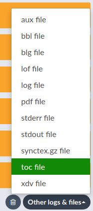
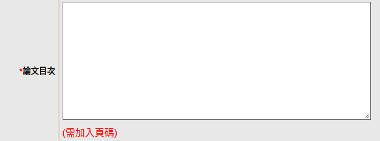

# toc2txt

Create textual table of contents with page numbers from LaTeX toc.

## Demo

Using example.toc generated from https://github.com/HW-Lee/nthu-thesis-template

```
$ python toc2txt.py example.toc
       誌謝.....................................v
       Acknowledgements.......................vii
       摘要....................................ix
       Abstract................................xi
1      Introduction.............................1
1.1    Motivation...............................1
1.2    Goal.....................................2
1.3    Divide and Conquer.......................2
1.3.1  Definition...............................2
1.3.2  Main Contribution of This Dissertation...3
       Reducing the Difficulty of Problems......3
       Independence of Subproblems..............3
       Parallelism..............................3
2      Overview of OMR..........................5
2.1    Binarization.............................5
2.2    Staff Detection and Removal..............6
       References...............................7
```

## Usage

1. Build your thesis PDF. This step generates the *.toc file. For Overleaf see [this](#overleaf).
2. (Optional) `pip install wcwidth` to support calculate CJK widths correctly.
3. `python toc2txt.py filename.toc`

## <a name="overleaf"></a>Getting the .toc file from Overleaf

1. 
2. 
3. 

## Why am I doing this


